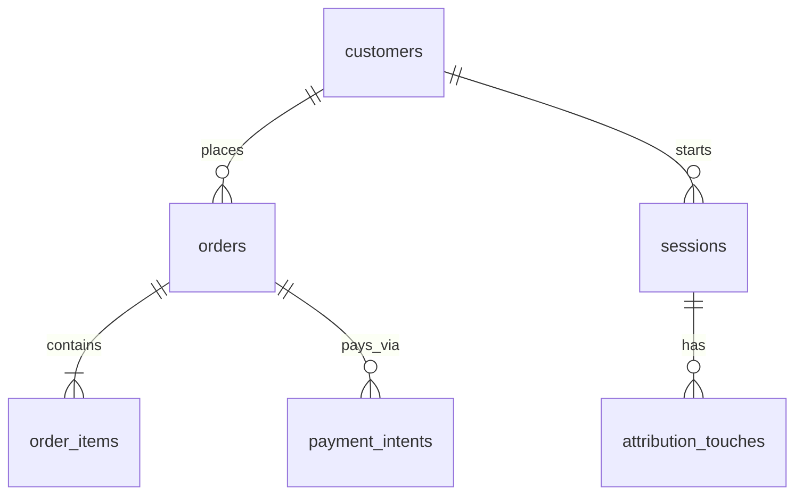

# ecom Schema Notes

Personal recon dictionary for the `ecom` schema — built Day 1, extended throughout the program.

---

## A. Table Inventory

| table | approx_rows | what it stores | grain |

| session_events | 292,903 | instrumented event stream (page views, cart adds, etc.) | 1 row = 1 event |
| order_status_history | 158,414 | log of status changes per order over time | 1 row = 1 status change |
| experiment_assignments | 140,670 | which A/B test variant a user/session was shown | 1 row = 1 assignment |
| attribution_touches | 100,000 | marketing touchpoints (UTM/channel) before conversion | 1 row = 1 touch |
| sessions | 100,000 | website browsing sessions | 1 row = 1 session |
| devices | 85,168 | devices used to browse/shop | 1 row = 1 device |
| order_items | 81,806 | line items inside orders | 1 row = 1 product line in an order |
| payment_transactions | 40,034 | individual payment attempts | 1 row = 1 payment attempt |
| orders | 40,000 | customer orders | 1 row = 1 order |
| payment_intents | 40,000 | intent to pay for an order (pre-transaction) | 1 row = 1 payment intent |
| attribution_campaigns | 38,405 | bridge linking touches to campaigns | 1 row = 1 touch-campaign link |
| shipments | 32,089 | shipping records per order | 1 row = 1 shipment |
| inventory_movements | 30,207 | stock changes (in/out) | 1 row = 1 stock movement |
| prices | 24,180 | product/variant pricing over time | 1 row = 1 price record |
| loyalty_transactions | 21,475 | loyalty points earned/spent | 1 row = 1 loyalty transaction |
| segment_memberships | 16,461 | which customers belong to which segment | 1 row = 1 customer-segment link |
| addresses | 16,000 | physical addresses | 1 row = 1 address |
| customer_addresses | 16,000 | link between customers and addresses | 1 row = 1 customer-address link |
| product_variants | 12,090 | sellable variants of products (size/color) | 1 row = 1 variant |
| customers | 10,000 | customer accounts | 1 row = 1 customer |
| product_reviews | 8,000 | customer reviews on products | 1 row = 1 review |
| product_images | 7,188 | images per product | 1 row = 1 image |
| notifications | 6,856 | sent notifications (email/SMS/push) | 1 row = 1 notification sent |
| products | 4,000 | product catalog | 1 row = 1 product |
| loyalty_accounts | 3,000 | customer loyalty program membership | 1 row = 1 loyalty account |
| return_items | 2,004 | items within a return request | 1 row = 1 returned line item |
| inventory_items | 2,000 | stock-keeping records per variant/warehouse | 1 row = 1 inventory record |
| return_requests | 1,603 | customer return requests | 1 row = 1 return request |
| refunds | 260 | refunds issued | 1 row = 1 refund |
| brands | 120 | product brands | 1 row = 1 brand |
| marketing_campaigns | 100 | marketing campaign definitions | 1 row = 1 campaign |
| coupons | 50 | discount coupons | 1 row = 1 coupon |
| promotion_rules | 30 | rules attached to promotions | 1 row = 1 rule |
| promotions | 20 | promotional offers | 1 row = 1 promotion |
| categories | 18 | product categories | 1 row = 1 category |
| experiment_variants | 12 | variants within an A/B experiment | 1 row = 1 variant definition |
| customer_segments | 10 | segment definitions | 1 row = 1 segment |
| return_reasons | 8 | reference list of return reasons | 1 row = 1 reason |
| experiments | 6 | A/B test definitions | 1 row = 1 experiment |
| payment_methods | 5 | reference list of payment methods | 1 row = 1 method |
| shipping_methods | 3 | reference list of shipping methods | 1 row = 1 method |
| shipping_carriers | 3 | reference list of carriers | 1 row = 1 carrier |
| price_lists | 2 | pricing list definitions (e.g. regional) | 1 row = 1 price list |
| collections | 0 | unused/unfinished feature | n/a |
| collection_products | 0 | unused/unfinished feature | n/a |
| consents | 0 | unused/unfinished feature | n/a |

---

## B. Per-Column Notes

### orders
- `order_id` (bigint, PK) — unique order identifier; joins to `order_items.order_id`, `payment_intents.order_id`
- `order_number` (text) — human-facing order number
- `created_at` (timestamptz) — when the order was placed, set once on insert
- `customer_id` (bigint) — joins to `customers.customer_id`
- `session_id` (uuid) — joins to `sessions.session_id`
- `cart_id` (uuid) — cart the order originated from
- `price_list_id` (bigint) — joins to `price_lists.price_list_id`
- `status` — fulfillment state. Values: `delivered` (19,779), `shipped` (7,715), `paid` (3,946), `packed` (3,887), `cancelled` (2,178), `placed` (1,897), plus case-duplicates `SHIPPED` (248), `DELIVERED` (200), `Shipped` (150). **Normalize with `lower()` before grouping/filtering.**
- `payment_status` — "did it convert" column, distinct from `status`. Values: `paid` (37,822), `failed` (2,178). Clean, no case issues.
- `subtotal`, `discount`, `tax`, `shipping_fee`, `total` (numeric) — order-level money fields, currency assumed INR unless noted otherwise
- `shipping_address_id` / `billing_address_id` (bigint) — join to `addresses.address_id`
- `applied_coupon_id` / `applied_promo_id` (bigint) — join to `coupons` / `promotions`

### order_items
- `order_id` (bigint) — joins to `orders.order_id`
- `variant_id` (bigint) — joins to `product_variants.variant_id`
- `qty` (integer) — units purchased in this line
- `unit_price`, `line_discount`, `line_total` (numeric) — line-level money fields

### customers
- `customer_id` (bigint, PK) — joins to `orders.customer_id`, `sessions.customer_id`
- `created_at` (timestamptz) — signup date, set once
- `first_name`, `last_name` — watch for encoding/whitespace issues per the task brief's pitfalls list
- `dob` (date) — watch for sentinel values (e.g. `1900-01-01`, `2099-12-31`) per the brief
- `gender`, `primary_email`, `primary_phone` — self-explanatory
- `country` — values: `India` (7,641), `United States` (1,359), blank (500), `N/A` (300), another blank-looking value (200). **At least 3 "unknown" representations — normalize with `coalesce(nullif(trim(country), ''), 'N/A')`.**
- `state`, `city` — location fields
- `is_email_verified`, `is_phone_verified`, `marketing_opt_in` (boolean)
- `lifecycle_stage` — customer lifecycle bucket (not yet profiled)
- `acquisition_channel` — values: `organic` (4,023), `paid` (3,490), `referral` (1,192), `email` (708), `affiliate` (587). Total = 10,000, matches customer count exactly — no NULLs.
- `source`, `utm_campaign`, `utm_medium`, `utm_source` — original signup attribution fields

### sessions
- `session_id` (uuid, PK) — joins to `orders.session_id`, `attribution_touches.session_id`
- `started_at` / `ended_at` (timestamptz) — session bounds
- `customer_id` (bigint) — joins to `customers.customer_id`; null for anonymous sessions
- `anonymous_id` (uuid) — anonymous visitor tracking before login
- `device_id` (bigint) — joins to `devices.device_id`
- `ip_address` (inet), `country`, `region`, `city` — geo fields
- `landing_page`, `referrer` (text)

### attribution_touches
- `touch_id` (bigint, PK) — joins to `attribution_campaigns.touch_id`
- `session_id` (uuid) — joins to `sessions.session_id`
- `touched_at` (timestamptz) — when the marketing touch occurred
- `utm_source`, `utm_medium`, `utm_campaign`, `utm_term`, `utm_content` — raw UTM fields
- `channel` — values: `organic` (39,924), `paid` (34,905), `referral` (12,146), `email` (6,995), `affiliate` (6,030). Same 5 channel names as `customers.acquisition_channel` — consistent naming across tables. This is touch-level (many per customer), not customer-level.
- `referrer` (text)

### payment_intents
- `payment_intent_id` (bigint, PK)
- `order_id` (bigint) — joins to `orders.order_id`
- `created_at` (timestamptz)
- `payment_method_id` (bigint) — joins to `payment_methods.payment_method_id`
- `amount` (numeric)
- `status` — values: `succeeded` (38,134), `failed` (1,866). **Different vocabulary than `orders.payment_status` (`paid`/`failed`) for what looks like the same concept — don't assume the two tables use the same words for the same thing.**

---

## C. Verified Relationships

| parent | child | join column | orphan count |
|---|---|---|---|
| orders | order_items | order_id | 0 (clean) |
| customers | orders | customer_id | 0 (clean) |
| orders | payment_intents | order_id | 0 (clean) |
| sessions | attribution_touches | session_id | 0 (clean) |

No declared foreign keys exist in this schema at all (confirmed via `information_schema.table_constraints` — zero rows). All relationships above are "soft" — enforced only by naming convention — and have been manually verified as orphan-free.

---

## D. ER Diagram

## E. Five Things That Surprised Me

- `orders.status` has the same value spelled in three different capitalizations (`shipped`/`SHIPPED`/`Shipped`, `delivered`/`DELIVERED`) — must `lower()` before grouping or filtering, or 398 rows silently fall out of a naive query.
- `customers.country` has at least three different representations of "unknown" — a blank value, another blank-looking value, and the literal text `'N/A'` — none of which are caught by a simple `IS NOT NULL` check.
- `payment_intents.status` uses different wording (`succeeded`/`failed`) than `orders.payment_status` (`paid`/`failed`) for what appears to be the same underlying concept — the two tables don't share vocabulary.
- `collections`, `collection_products`, and `consents` are completely empty (0 rows) — unfinished/unused product features, not a querying mistake.
- The database has **no declared foreign keys at all** — every table relationship is informal, based purely on column naming conventions, and had to be verified manually with orphan-count checks rather than trusted from the schema itself.
